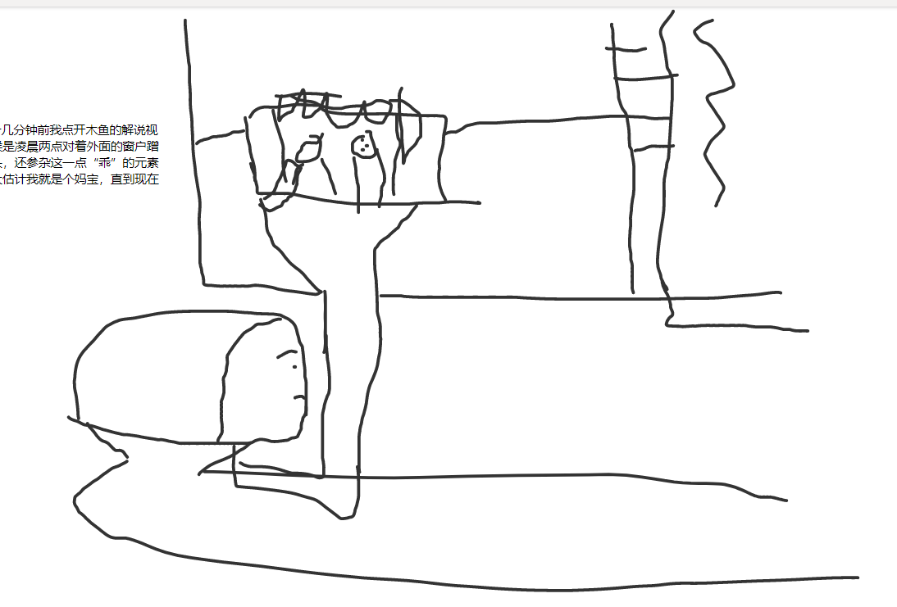

大不知世界是，但见无他闻，闭目。 持野草至宝，再创本存物，思无用。
# Part-1 SEX and Relationship
## 手机寄修的一个晚上
一天台一门一月
三声蝉三亿星三百支花三十美酒
一手机无数条信息
但一个人
赏用着六月美景美酒
但一个人
等一声与众不同的提示音
等不到，他在玩游戏
一直都在。。。。
## 对父亲的批判
有些人是往前看的，大概就是基于当前条件提升当前条件。这种利滚利的追求也会基于当前身体条件降低当前身体条件，忙碌了一段时间后发现这是愚蠢的，因为除了名利和追求还有更重要的东西，恍然大悟姗姗来迟。
> 是父子关系 更重要 他在工作 不想管我   
> 我多少也受到了影响

## 一见钟情 但男生
有一天女孩终于意识到了她编造的碎碎念是真正的道理 那不是爱那是风光雪月下完美的幻觉 但是 who care 他只好假戏真做 收起一些对另外一个人的权限 并情告诉自己这不是爱  
花痴女孩啊 两天过去了你还记得他的样子吗 他只是你的过路人
## 无力避免的空虚和暑假 忘记了什么是空洞
暑假男孩 在家中  
时间多到玩两个账号 时间多到静静发呆 不想做任何工作  
生活枯燥 暑假男孩 没人约 在床上 一个人
翻手机 没信息 开游戏 没体力 各种无聊
线上光芒四射 现充无人问津 心比空调冰 情比什么静 那只是演出的戏  
我想想我这几个暑假都干嘛了 小学和一位“好朋友”用蜡烛八宝粥罐子煮鸡蛋汤 摘莲子 其他的单车到处撞 吃黄皮仔比谁的仔多 在笔记本摄像头前摆各种奇怪的pose 后来走了好朋友来了两位好同学 初一初二的暑假没发生什么 高一的暑假在家里吃喝拉撒睡还乱花钱 不帮家里人干活整天对着手机嘻嘻哈哈 去爬了一次山 再去了一次北海和一堆我不认识的没有共同话题的人去 对着一堆人的其中一名男子发情 明明过得很好但是我总觉得这个暑假很无聊 明明出去玩了 出去旅游了。。。。。。。。
## 人神分离
曾经何时想与你发生性关系 和你共度一世 整个脑子都是你 去那里玩都有计划以后和你来这里，不 我们的灵魂交织不到一起 你再令我心欢都明确的知道对你的爱只是肉体上的 这不是爱 是完美的幻觉
在我为你痴迷的时候我疯狂追求 但是你的注意力却在别人身上 当我死心的时候我给自己疯狂灌输谎言 当我对你麻木的时候你才开始 珍惜
## 16岁结束语
灿烂浪漫 散发光芒 戏最最多 吞云吐雾 绝不妥协 标新立异 全是sex 糜烂的16岁 我 崇拜 糜烂
## 落枕有感
僵住的不止我的脖子 还有欲望 骗谁呢你的欲望活蹦乱跳呢 没有啦！戳什么戳 痛死老子了！
## 愤世嫉俗#1
我相信人们会个体化全世界都会抵抗“团结是力量”的狗屁言论
## 愤世嫉俗#2
那天我一边听着lost boy一边开着QQ看着手中的G5越来越热，看着手里的Z play续航越来越崩。我就想解决办法，不过应为多动症的原因我很快把这个的想法转移了。暴走大事件已经停停走的不正常播出了一两期了，据说是应为某些高层，我恨这些为了面子的东西。我去找资源的时候整个LG G5都热了，在QQ找的，我崩溃了，从十九大开始想走的欲望一直没有听过 惊喜2017 不再爱中国
## 人神分离#2
我跨年的时候不是欢喜是敬畏是神奇是害怕 就像那天晚上2点曾WiFi追CLANNAD一样 一下子就毕业工作了我还没缓过来心里一直很难受非常压抑 明明在学校里好好的 明明可以毕业了就end的 真想一脚踹他们回学校继续演下去 这种又悔恨又害怕的感觉 人生第一次  
啊！  
当时想起了一句话“那四小时是人生当中最美好的下午”是看to the moon解说的其中一条弹幕 我觉得如果套在那个时候非常可笑 熬夜追番还美好 笑出声 现在看起来这是个值得回忆的事情 应为大脑会给任何东西添加饱和度添加色彩。
## 该死的起源
我现在还历历在目那时学前班的我应为老师没有给一个准确的信息而放弃了交作业，老师要求写一行的数字1 你也知道的数字本的格式是只有一行的 写个1我能把整行涂满 就像小数点后面的零一样没有界限 在我还没有写完一行数字1的时候 老师要求写数字2了 完全跟不上索性不写了 不交了 把笔扔下的时候这一个小振动 可能会带来一次火山爆发 而我却再也无法成为一名优秀的人了。  
不要小看蝴蝶效益
> 你知道这不怪你的 就算你写满了数字1也不能什么优秀不优秀的 你本身就优秀

## 结束语
年味啊年味！你已经不属于这个时代了吧。
## 结束语
远离他们  
反抗一切东西

# Part-2 desperation
只写进了OneNote———— 一些无聊没人看的事情
## 镜子里面的人是谁？
我对着镜子绑头发 突然橡胶圈断了 头发瞬时而然的往下踏    
那瞬间我在镜子面前看到了另一个人 额头的皱纹 鼻子下方的胡渣 眼睛下垂 泪沟很明显 坑坑洼洼的脸上 仿佛是经历了大风大浪之后的样子 我盯着那个不认识的人 他也在盯着我
## 年轻真好
今天走路去逛超市 回来的时候看见一个穿着红色vans的小哥哥跑着过了马路 我领着一袋东西跑不过去 走到公园的时候发现原来是跳街舞的 不止跳街舞 还有玩滑板的 跳起来踩回去的招数弄不出来我跟着笑了一下 此时一位穿着红色匡威的17岁小哥哥领着一袋东西经过 留下了一句“年轻真好”
## 忘不掉
神啊 请给我一个第二天能记住的 走马灯的梦吗 我希望再体验一次人生中幸福的时刻 从而忘记那些令人懊恼的事情

## 你离开了他们得到了什么
更充裕的精力  
更充沛的时间  
更冲忙的搭配  
更随性的自己  
更糟糕的人脉  
更坏的心理状态
## 一些牢骚#1
小时候奶奶一直教导我说啊“出到外面别人不骂你骂家里人喂，知道吗？说没教养喂 你都不知道多稳镇（被动不太好无奈之类的）”  
小时候爸爸一直教导我说啊“弟弟沉迷游戏无心学习就是怪你哦，近墨者黑啊，你知道什么意思谋？（疯狂解释）近朱者赤啊（疯狂解释）”我职中快毕业了我弟才刚六年级，记得是小学还是初一二的时候这样子说的。  
我又近谁？我一直在家我能近谁？你我的关系都不好我还能近你吗？我能近谁？除了电脑手机我还能近谁？明明知道我这样子朋友少？你老婆邋遢丢三落四大小姐范你也知道，为什么她的任何缺点都复制过来了，而你村的干净整洁我就没有继承？为什么我半夜在这里推卸责任？  
就在这时我搞清楚为什么我爸他哥哥的儿子为什么那么的干净了，应为他们家的关系一直很亲密，而且父亲在儿子长粉刺的时候还会教他那些能挤那些不能挤，甚至有点羡慕伯父伯母能恩恩爱爱到现在。现在我妈向亲朋好友和他的儿子疯狂说他的坏话，为自己申冤。为了钱从我小吵到现在 还说为的是我。  
我妈在骂我的时候非常坚决的说出来“我天天刷牙你刷吗？”后来想想我妈为什么要和我比高低？那次吵架的影响巨大，应为我拿了我妈的手机被我弟摔了，一直在说归根到底还不是应为你。你不玩手机你弟也不玩，也不会想要这个手机也不会摔坏。直到今天我还在想全部都是我的错，包括在上面写的类似于推卸责任之类的想来想去还是我的错。  
一群没救的疯子
## 一些牢骚#2
不用说，他这次跑到上面住着十有八九是为了躲避锻炼，真是令人火大，从小到大都这样，奸诈的很。本来还以为长大了会好起来，还真的是狗改不了吃屎。我叫了啊弟打电话给他叫他回来练车，结果都挂了，打给她妈才转接上的，后来他还直接挂了我的电话……
嘟～
中午11点我妈把我接了进去，我当时超困，但是我睡不着，根本没有力气。上床了就拿起手机写点东西什么的，我相信你也会觉得自己的一生静干蠢事什么的。 哒哒哒哒哒
更令人火大的是他一回来就往床上躺着玩手机也不帮干活
## 假可乐
```
今天逛超市看到一个棕褐色的饮料 上面写着汽水 还写着个亚洲 我还以为是一些无名商家推出了非常可乐之类的冒牌可乐 凑过去一看还有玻璃瓶装的 然后还有大瓶 还占了一个冰箱 这就很诱人了 我对着那商标寻思这不是可乐吗怎么商标上没写有 写这个什么沙市 我就买了 然后现在喝了几口
开盖的时候一股清香的药膏味扑鼻而来 白虎精风油精清凉油铁打nigger油van花铁打酒在我的鼻子里消散开来 勾起了小时候摔跤的的记忆 光闻着就高潮了 喝起来应该会晕过去吧
饮料倒进口中 味道像极了可口可乐 但是却不像是可口可乐 像是小时候五毛钱一瓶的冰镇垃圾可乐 各种回忆从舌尖加速冲上大脑 就在这意识渐渐消失 黑字渐渐晕厥之际
板蓝根维C银翘颗粒999琵琶强力止咳露蛇胆川贝液等药品就像一位大哥哥一样把你拦住不让你摔倒 这！这是回甘！
（喝了个刺鼻的可乐写了一个饮后感也是牛皮）
总结 可以接受的难喝
```
## 十七岁结束语
17 years old  
more tears  
more hurts  
more needs  
more alone  
Fucking The Self Healing it Sucks！  
All years long just sad！
## 狗屁不通的英文
high school kid don't know how they shiny , they just want look like more mature and hide they should have the shiny/brightness,
## 为了悲伤而悲伤
* 2039年十二月十号
  我以为我能花光所有幸苦攒下来的积蓄，不过并没有。找工作事件很痛苦的事情，尤其是对于我这种人来说，好在有一家公司愿意接受我这种好吃懒做的油腻中年男子，但是我却在重要的时刻睡过头了。现在我有理由接着我的花光积蓄的挑战了。
* 2040年十二月二十三号
  我从尿意中醒来，解决掉这个烫手的山芋后我看了一下时间，二十三点四十分。我还想继续睡“我是在十七点时入睡的”现在应该睡不着了，这种日夜颠倒的生活已经持续了两周了，两周内我基本没出过多少次门，垃圾也成堆了，但是我压根不在意。打开游戏就是一顿狂玩，完了累了就做点刺激的事情，今天才没过几小时我就弄了三次。这种次数还在上涨，人本身就是这样不满足的生物。母胎solo了几十年，自然不用担心任何跟生育相关的事情，再说了我也是个同性恋者。刚刚在玩游戏时突然抽出了一下，我在我年轻的时候看过科普视频，这只是一些正常的事情也没在意。此时已经是中午12点了，吃点什么东西睡了吧。我也想过自杀什么的，但是总感觉有什么不对就没做了。今天过得真不如意啊！一大早听什么喪歌去买菜啊操！
* 2049年一月二十四号 天气还好 也不冷
  本来今天是春节的，却接到上级通知，调查一个男尸，大过年的，真晦气！“根据尸体的情况来看已经死了一个月了，死于猝死，尸无衣物，体躺在床上，推测是在睡觉…” 报告上说道。唉…死了一个月没人发现……这种事情也不是第一次了……上次还有个死了一年的老人家。不知道为什么这次很有感觉，比老人去世的还要揪心。

## part-3 reborn
## 十八岁结束语
to be a better person
## 幸福
刚刚去沙县吃面的时候恰好碰到店家吃晚餐，也是9月1号又是八点多，一对看起来刚上的小学兄弟要看开学第一天，母亲却搜不到，哥哥说我同学是这样搜的还是搜不到，两个小孩争了半天，父亲看着事情不妙有些无可奈何得说道：“这里还有一台”，找一段时间后就跑到隔壁家去看了。想到枯燥的柴米油盐生活一天天不断重复着，有一种别样的幸福感。也许这就是“父母”们疯狂逼婚的原因吧，他们亲身体验过这种和睦感。
## 丢失时间
七点整天色就暗下来了夏天也过去了，现在是秋天，一眨眼刮两次风就得穿大衣了，一年就过去了，手机设置时间明明时间设置对了就是连接不上网络，仔细一看才知道是年份错了，明明Android L和M长得很像这几乎没什么变化，LMNOPQ都是，数字从5-1不断的增长着，长得太像 还以为我用的是Android 6.1实际我用的是Android P，不是特别强调我还以为现在是2016，直到春节后一个月才接受是2019。
## 快速梦
在雷雨天回学校，神奇的前面的人能轻易跳过去的阶级到我这就高到胸了，在我尝试着上去的时候，一道闪电劈了下来，在距离我的上方几十米发生爆炸。我被炸飞了！由于快速梦的特性，清晰得能感受到并记住，飞出去的那种风划过脸庞，在空中优雅的空翻的无线眩晕和炸到胃的痛觉，还有视觉也算是脑补出来了………
## 一切安排妥当
一切都安排妥当了，我此时躺在楼顶上，有点热，但有风，阵阵的吹过来，吹过我的下巴、头发、躯体。搭配着一点点的星星，酒精最狂烈的时刻过去，留下不加思索的大脑，让我诗意大发。  
回想几个小时前，我们在太阳快要进入黄昏时出去收集食物，在天空变成粉红时忙着处理食物，在天空马上变暗时进食。火锅和烧烤是最终的目标，后来在十一点左右接近尾声，剩下这个屋子的主人在清扫满地疮痍。   
这是属于我的高光时刻，其中一刻是别人的手抚摸到了我颈部的皮肤、头皮，我可能孤独太久了，这样简单的触摸让我兴奋不已。这是和性快感挂钩的事情，还有就是我在过程中摄入了酒精，在最猛烈的时候听着lana的野花野火，眩晕、治愈、兴奋、快乐、孤独混杂在一起。  
我写完了，结束前的事情。一切安排妥当，我来享受当下了。
# Part 2.9
## 冲后感
我忘记我多久没有玩弄我的下体了，有四五天了吧。在快射的时候其实快感已经有了，射了之后快感涌入脑内，在几十秒后达到巅峰，我就像触电一样颤抖。我的心脏附近感觉像是被塞满一样，太舒服了。疲惫感在后面到来，正好等一下的垃圾课不需要什么垃圾精神。在吼叫两声之后，我嘴角上扬在傻笑，一脸满足和疲惫。  
在冲后两个小时左右醒起来，课堂上。睡了大概有十分钟左右，好久没那么猛的
## 上帝啊为什么我没有第三只手
在看视频时不小心碰到了我的乳头，奇怪的是他变得硬了，我用母指来回摩擦着这个微微凸起的器官，像是porn里面经常做的样子。其实我根本不理解为什么他们能那么兴奋，随着摩擦的时间越来越长，我现在渐渐的知道了。我开始想象着你与我共享青春的尾巴，在午后阳光洒在地面时，在床上面对面发呆，你那成熟又青涩的脸庞像极了新海诚用尽全力描述的彼岸之时，这他妈的太鸡巴诱人了。接着我们脱下裤子，用手握住我的阴茎来回搓动，在左手忙得不可开交的时候你用舌头狡猾地挑逗着我的乳头。  
我们躺在床上，互相欣赏对方的每一个毛孔，皮肤上的痘印，让我看到了你在青春期时的热血，我用手去抚摸它。我们的兴奋就在这样的抚摸下互相传递，渐渐加强。我转过身来，用脸迎接你的身体，有律动的亲吻着你的身体，在这个时候你的呼吸已经。  
我能享用你的身体吗，把鼻子靠近你年轻的身体，我估计会闻到一丝丝你的香皂味，更多的是属于你自己分泌的信息素，我的主观意识可能察觉不到有什么成分在里面，我想这种味道只属于你。激烈的心跳声，心脏也想闻闻对方的味道。我们的身体都很平凡，但这是
## 快速梦
梦到了一堆小时候的玩意，想起来贼头疼，第一眼看到了天花板，第二眼看向了门外，我还以为现在是2006年后来意识到时间穿梭这种事情怎么可能存在呢。话说我也马上20了啊，想想十五岁开始的事情也没啥什么事情，一眨眼就五年了啊，16岁的你还觉得20岁以后的生活应该挺不错的吧，想着想着一不小心就17岁了啊，甚至觉得成年这种事情离我还很远的啦。逃避着逃避着18就过完了。
马上就要2020年了，2021，2022，2023，2024，2026，2027，2028，十年过去了舆论就像是2015年以后一样从80后转向90后再慢慢往前推，五年内90后几乎没有多大话题了，慢慢被淡忘了。
说起来有点不可思议，我的童年好友已经快10年没见了。
而搞笑的事情是我居然把2028当成了下一个十年。
## 一些牢骚
一堆事情要说，但不想说，这些东西说起来都一样，听的都厌倦了。这又是另外一个无解事项，像蛇咬住尾巴一样无限循环，锁起来的重物拖着我，直到有一天我无法下降。迷失在快感中的我难以清醒，一次两次的透支身体。damn！我到底在想什么，某些时刻眼泪掉了下来我却毫无感受，某些时刻明明结束了可却还在启动中，关于我的身体我自己的这些迷惑谁也带不走。这又是一个无解事项。
## 驾驶员
当我看我以前录制的视频的时候我看到了一个不太熟练的操纵员在使用一个比较不错的身体，尤其是那种只看到手的视频。
# Part 3.7 疫情
## 绑架
这个社会绑架了我们的牛子。可以说，我的大脑在下体，头里面装的是鸡巴。
## 关于陈国裕
Fuck You is what I thinking right now.  
我搞不懂很多事情，你的长相平平无奇却戳人痛点。对于你的颜值只能到达一般般的水平，很一般甚至有点偏低。不是很高不是很瘦，盲目自大，懒。但是你就像那个皮鞭，满足了抖M的一切需求，为了得到隐藏在背后的快感可以忍受一切痛苦，得到你可比忍受皮鞭抽打的痛感这点小问题要快活得多的多。  
有一段时间我看向你的脸的时候我的脑上全是精虫，而这些精虫在消退下来后让我痛不欲生。记得有半年时间我没有见到你，几个月以来第一次我见到你那天的晚上，整个人都不好了，情绪拿手疯狂波动心弦，无序的制造噪音。那几天我一直思考一个问题，“为什么我要喜欢上这个傻逼”。其实他也不傻逼，是我傻逼。  
在某种比喻上他这个人对于我来说是毒品，当我靠近他、发生简单的肢体接触或者看到他的脸时，像是触碰到了云端，而神在上面迎接着我，紧接着他说了一句：“你得不到我 我对你只是朋友关系 ”，长出了牛角面目变红瞬间拉倒地狱，“这种感觉不属于你应该拥有的 给我下地狱”。太狗屎了，dont don't shoot  me down 。  
我需要你，你有我在别人身上找不到的感觉，但我不行，我一直在想为什么是你而不是别人，或者为什么是我。时至今日，从高中时期的初次相遇到现在四年间，你只会在我的脑海里反复加强你很稀有的信号，你没有做错什么，我也没有，而这个信号会随着我走过一生 走进坟墓，永远无法忘怀。  
去你妈的性欲，操。
## 没有感觉
Pain is all I got when I'm doing things like sex.  
时间倒回一年前，很多事情都记不清了 回忆起那件事情，只剩一张画面 一个人无聊的坐在电影院里看电影。让我哭过的电影其实也没有多少，松子是第一个，第二个是海蒂和爷爷，第三个是你的名字。就冲着这个，我去看了新海诚的新作 天气之子。走出电影院时我不知道用什么词描述当时的状态，有些小气愤 和疑惑 或迷茫，上面说到的那一张画面就是在这的，而电影是快要播到结束时，一般来说作为因果关系为主要思考的思想，一定是前期做铺垫 后面收起来时情绪渲染到位 收！影片结束。一对情侣 三年后相遇了 音乐停止 微风吹过 一阵子后音乐炸了出来 青涩的主唱大声喊出歌词 情侣拥抱在一起痛哭，用视听盛宴形容再不为过，要知道这是新海诚，随便截图帧帧壁纸的新海诚。气愤的点在于我完全没有感觉，对于突然炸出来的音乐 没有惊吓 没有惊喜 没有伤感 什么都没有，为什么？是电影的问题？还是我的问题？  
那些时候我的感觉似乎从来没有和我达成共识过，在观看松子时我不知道为什么我的眼泪就流了下来，而且一流流了十多分钟，有些时候我甚至分不清是假笑还是真笑，外面笑着 内心质问自己开心吗？  
明明自己一个人的时候躺着都会硬，面对口交时完全硬不起来，为什么？是惩罚吗？惩罚什么？前两年不是可以硬但射不出来吗？为什么这次都硬不起来？是人的问题吗？我换了三个人还是没有感觉啊？换了好多地点也还是没有感觉啊？为什么？我都停下撸管了你还要我怎么样？  
似乎在几个月前希望得到性的那个我死了，活在性高潮 的渴望没了，似乎我生来就是没有感觉的，似乎做爱这件事情 只剩下了痛苦。
## 简单描述今天我都干了什么
8点挣扎这起床，拿起手机，找老师补签，老师在直播间也许讲得非常辛苦，but i don't giva fuck，打开B站，然后无聊录了视频，剪了两三个小时教程发现我的声音完全达不到预期。现在还没剪完，1点整吃饭然后躺了一个下午，一个晚上，fuck。
## 梦呓
人类原始明显的需求就暴力 地位 性，围绕着我这种年轻人的主要特点为 骂脏话 他人关注 打手冲。 如果把手淫作为一种瘾品作为对比的话，这觉到算得上是一件危害极小的瘾品，对于年轻人的身体来说。与免费相生相克的是代价，    从初二开始性就围绕着我长大，就从那个时候起脑子长了个鸡巴，出门一看都是行走的逼和鸡巴。性爱只有性没有爱，甚至我觉得“一见钟情”应该早上留号码晚上fuck it up，在这篇文章里面我没有“爱的喜欢”这个概念，我喜欢想要追的人永远是满足我的下体的需求的人。我将其称之为dick love或者pussy love。深陷燥热性欲 时时刻刻在泄火的我没想好应该叫什么障碍，像是 没对象性交障碍？还有性郁症，指的是年轻人因为没有性生活产生的抑郁情绪不能消化。编不下去了，后面再写。

## 性高潮是是假毒品
性高潮真的是太棒了，那一段时间里面我像是在电影里面吸毒的镜头一样，闭眼享受，把头仰起，愉悦的呼吸，脑子里像是把几十年的快感炸开用管子输入里面一样，源源不断。  
在一个半小时后我躺在床上，刚刚出去吃了点饭，然后躺床上看视频时脑中闪现几张色情的画面，让我想立即把门关上锁起来冲一发，转念一想我已经冲过了，这太可怕了。  
又一个小时后  
I can't stop that shit ，我的鸡儿和我的大脑一直在向我索求性高潮的快感，快要坚持不住了，我不想看色情影片，但想看。  
第二次，今天第二次手淫，一边说着你在干什么、停下来等词汇，一边用右手不熟悉艰难的操控手机获取色情影片，仅仅四个小时内达成了两次性高潮，drug is cumshot。  
24小时内的第三次手淫，快感真的很好，但是令我有例外的罪恶感，还能停下来吗？那么爽。  
fuck ! I felt so good and I feel like I'm flooring in the air , I can't stop it  
在第三天凌晨2 3点时马上就要就要睡觉了，回想一整个白天都没有怎么碰到下体，主要是片子没有感觉了，终于停下来了。
## Fuck LOVE
从二月份躺到五月，出来走个两三四百米小腿有点疼，这条正经走过两年 一天三次来回的小道变得不一样了。在那个被油脂拉长的灯光下，就在几分钟前，有一位叔叔对着阿姨录视频，阿姨在灯光下面翩翩起舞，羡慕。看到的第一个反应是想分享给父母看，一边酸一边想着母亲在灯光下的笑容，傲娇的父亲撇着嘴内心暗喜录着视频。但后面这一幕让我感到悲伤，实际上这种事情根本不可能发生，人活了四五十年和一个不喜欢的人在一起，憋屈。
## Sex and Love
我似乎不能很好的区分爱情和性的区别，似乎只有性，没有爱这个概念在我的脑海里。这句话只在那首日文歌爱能做到的事情 mo mada lukai 生效，电影里面刻画的丰富世界过于丰富，也……  
我可能还是被父母下了诅咒  
我乱了，也许我需要休息了。   
## 那幅画
细心回忆起那个画面，现在有点想勃起，是相机往上看到一个男人的剪影，和他的鸡巴。但说实话，那个时候的我就像是出神了一样，通感到了刷各种Porn站的时候 不断往下滑的感觉，还有那天在电影院看天气之子的感觉。

## 疫情假期结束的真实感受
###
虽然在疫情假期时我多次请求开学，而我在出租屋也待了一年半了，我也挺期待能快速开学的。现在我反悔了，从一月上旬呆到五月上旬，同一个房间、一天天基本重复的作息生活、宅在极小的空间、持续四五个月，突然被扔到一个陌生的常驻环境里，打乱空间、打乱作息、打乱一切、揉碎了重来，这是有落差感的。我想念那套屋子。
### 先来描述一下我今天都干了什么  
昨晚一个晚上没睡直接通宵  
早上六点直接睡觉 十点醒起来  
十二点左右上车好像  
下中午到钦州搬东西 去超市买东西 和母亲一起  
回来了之后和母亲分离  
洗了席子然后上楼顶想晒    
楼顶被锁 下楼梯摔了一跤因为这段时间我喜欢拖下鞋子赤脚走路  
把席子晒好了之后找到飞机杯冲了一发  
打开B站刷到7点多  
然后把特别脏的冰箱清洁后放入蔬菜 电脑装上 把碗洗好  
玩电脑到1点多做东西吃 吃完后打开OneNote  
完
### 
模糊记忆里面记着这样一个故事，主人公是我小时候，当时我是幼儿园里面比较大的孩子，听到幼儿园的时候我什么感觉都没有，爱送送呗。当时就去了，紧接着一段记忆是我非常害怕的打电话给父母，心想我是大孩子不能哭。后面就没有关于幼儿园的记忆了。
### 
还有一段记忆是第一次化疗时的记忆，现在回忆起来都有点想哭，我妈离开了一会，整个病房就我一个人坐在那里，我记得当时我也是无感知状态，就是什么感觉都没有陌生感 害怕 开心之类的完全没有。  
后面见到护士推着一辆车上面放着瓶子罐子向我推来，我感到一种没有感受过的感觉，我想我妈，我妈不在身边，紧接着的记忆是我哭了出来，我妈问我为什么哭，我说我不知道就是想哭，我妈一边摸着我的后背一边回答道类似于“不是想哭就能哭”之类的话语。
###
回首往事，像是火车guaguagua的往前冲，而在我刚刚看习惯了这一段风景时，下一段的风景就已经在我眼前了，当我初中时我想念刚刚拆掉的老家，时常想起来那个模样，但现在我想不起来了。高一时居住在县城，我想念初中在小镇上的欢乐时光。  
高二时我换了地方住，这是我第一次头也不回不再想念的时候，而这两年的时光却是我现在最怀念的时候，我像是被锁进了那段花开的时光，看着盛开一次就凋谢的花朵无能为力，只能祈求能记住开花的样子。就在前些日子我还会去当年住处的楼下小卖部，却不回忆任何的事情。
现在我大一，房子的记忆guanguanguang的往前冲，当我在套房时我守护高二出租房的回忆，想着学校附近的出租房，现在我在学校附近的出租房在回忆五个月的时间的套房记忆，即使我刚跟套房说再见不到一整天。  
或许以后我会越来越习惯这种风景没看完就往前冲的节奏，我知道有一天我会麻木的，这种事情经历多了。  
## 剧本
```
V1  
主角A问啥都不知道
V2
A向心里发问，啥都得不到回应。
V3
A实际上知道一部分的情感，向心里发问，什么都得不到回应
V4
A实际上一直知道一部分的情感，向心里发问，什么都得不到回应
```
## 写nm剧本
我在听Clannad的配乐，这是我中学的时候看的剧，当时可能是2.30上课，在前十几分钟前我点开木鱼的解说视频来了兴趣，就发誓一定要往下看完。就只有部分记忆的我只记得我当时看的时候是凌晨两点对着外面的窗户蹭楼下的网络，看到后面时那种感觉真的说不出来，一下子就变成大人的恐慌感上头，还参杂这一点“乖”的元素在里面，能哭的地方只有厕所或者爸爸的胸怀里这句话也有点戳中了我，从小到大估计我就是个妈宝，直到现在也是。  
就算是再跨年这个重要的时候也是会出现那种感觉，像是压力？
mgb本来想上楼顶吹吹风结果下雨了，没办法只好在门口坐着写了  

## 我的头下是一团狗屎
我向门望去，希望有一个人冲进来fuck me up，各种意义上的fuck都行。太无聊了，QQ啥也没有，循环播放的同一首歌在循环播放着。肚子饿了也不想吃饭啥也不想吃就让他继续饿着，或许蹲在楼顶上面码字别人看起来像是一个生活过不去的傻逼在吵架，或者一个中二少年在演中二戏码。我只想逃离这令我感到无聊的无聊房间，找到一个空旷的地方躺下，躺下很无聊我知道，but nothing better then that shot。可惜我躺不下，楼顶全是灰尘。  
脏话这玩意简直是舒服至极的，just fuck it all 。初中时主要的矛盾来源于家长，当小儿子做的不对时只会责怪我这个大儿子带坏了他从而掩盖自己的无能为力这件事情上，我也不想太过于责怪父母现在。在又一次被教育后 我直接冲上楼顶蹲在那里，抱怨为什么都没有效果，后面就叫了两句操你妈就舒服了，可现在不论操多少个都没起效果，但是也很爽。  
现在在楼顶的我也不知道要写什么了，写点套娃的东西，我在写我在写我在写我也不住到我要做什么了，操，这不是更无聊了吗。突然意识到我在和自己交谈，这么多年来没有得个多重人格都得感谢我强大的心。写完这玩意想发到别的地方刷存在感，说起来也是找个高质量性伴侣吧。
## 挺害怕治愈的歌听多了没感觉的。
像是治愈之王heidi这部电影也有无聊的一天，到时候真的痛苦的时候再去看就炸开了。因为曾经听过的歌在痛苦的时候疯狂听，后面没感觉的时候就更加痛苦了。
## sex and love
有时候真的得把爱拆出来慢慢分析，一般来说一见钟情绝对属于下体思考范畴，属于性，但我发现性毫无感觉，its not what I want 。当有人给你口交时其实就鸡巴会感觉到一点感觉 但是 只有下体，我的思考方式跟我说对下体需求已经排除了。fuck！对啊！那为什么我他妈天天手冲个不停还在冲嘛！可能还有寂寞领域完全没有碰到，
## 没有感觉
好像无感生殖器官状态又回来了，再一次厌倦手冲，没感觉，但是在闲下来时这种烧死人的欲望在汹汹燃烧，当勃起时试着上下抽动，没感觉，打开色情影片，还是没感觉。sick。
## fuck a moment
我只是在机房里等待下课，眼睛漫无目的随便乱射，当我看到他的眼睛时啊我要死了，青春朝气只属于他的，笑起来时我就是属于他的，没有人可以比与他的。  
这种事情发生了不止一次，我知道这绝对不是最后一次。  
oh fuck ！I'm just know that I gotta fuck him , I'm just know that I can't . I'm just know that I'm messup , I talk to my mind like man stop。
## 用牛粪包裹全身抵挡covid19的印度人
如同标题所说，我这舍友在用力的敲天花板，似乎是在警告楼上的女生安静点。但我觉得这没用，楼上的女生根本听不懂楼下的愤怒。现在的行为就像是家长被叛逆的孩子暴打后，哭着说“除了杨永信别无选择，这是我能想到的最好办法了”。
## 好想抱着谁哭啊
我需要的是在表象下面的温暖，或者说抱着谁哭可能一点感觉都没。
## GORE
你们想知道逛半个小时的网站看里面一堆分解实体之类的感受吗？手有点抖，还有点想呕，没看过的应该感到庆幸或者庆幸与在生活里面没有见过任何的在大街上自杀时不完整脸 爆裂开的身体 扭曲的肢体，亦或者庆幸与没有亲眼目睹大腿被货车压碎、小偷的头当街拿刀慢慢斩下来、冲浪把头冲没了、医生在清理20厘米的刀伤用海绵扣那个伤口等等。
实际上卧轨自杀的死相不是被火车碾成肉泥，而是以轨道为接线，干净利落的把人一分为二，甚至你能想象到自杀者抬起头看到自己的手和上下半身分离，并在痛苦中死去。而跳楼时肚子着地会像西瓜一样上下身裂开，不会立即死亡最大概率是失血过多而死，头着地时头不会有完整的头颅，一半一半吧，后续血迹也难清洗。  
两个最不推荐的自杀方法  
我在2020年上半年学到的，或者说一颗信息甘蔗 用时间嚼碎 我吸收到的汁 恐怕莫过于“活着真好”四个字，或者说人作为一种生活在地球的生物，四肢健全、远离危险、高寿高质量的活着或者有时候会忘记自己是一团肉，这种事情，真的是太不可思议了。   
有些时候有些事情真的本末倒置得很离谱，像是身边的人活不到70就会觉得可惜觉得跟沮丧 天嫉英才，damn！能出生都应该庆祝三天三夜了好吗！母亲没事再庆祝三天三夜！每年都在开心的庆祝生日，给他那的厄运看！告诉他我20岁了之类的！你有手有脚啥器官能用就能庆祝个死去活来的！我的天啊！
## 无意识
在写代码的时候觉得无聊于是听起了歌，是骚母的To Die For，又是和aretha的歌一样，在播放到某段的时候沉醉下去了，不得不带着一丝兴奋露出悲伤的表情，闭上眼睛，跟着音乐里的情绪唱出来。  
我的天啊 法海的歌简直不要太好听了吧 我哭了，尤其是歌曲的情绪和我本身的情绪结合时，直接抑郁。一方面这些歌太优秀了，一方面我耳朵听力下降，听一首少一首，以后会接着下降 下降 下降，直到我听不到为止。我的天啊！我无法想象到 我因为听不到声音而接触不到这种 神仙事情 的那一天。
## 走向恐怖
```
感觉以后会变成杀人犯这样子
刚刚在买切好的冰西瓜
那老板娘看起来有40
准备拿起整个西瓜马上切的时候
她的女儿跑了出来说了类似于
让我来吧
之类的话把活抢了过来

我当时是这样想的
这个女孩那么听话
要是死了那他妈不得哭死
好想把她杀了

心里非常愉悦，脑子不断的踊跃出影视作品的杀人瞬间
等了几分钟才到我的
看着这个乖女儿 在切西瓜 然后脑子里面全是想把刀抢过来捅她
其实我好像一直知道我在想什么事，也有制止的想法。
就好像你在手冲一样，明明知道这样冲下去不行，你在过程中也有停下来的想法。
```
## 在做爱时哭泣
我脱下裤子，摩擦阴茎，疯狂摩擦，但是就是没有任何愉悦或者感觉，越是没有感觉就越想要，我急了，烦躁了。我在脑子里脑补和别人性交的上等愉悦，把阴茎插进去，抽出来，对就是这样，对，为什么还是没有感觉。
## 焦虑
时隔六年，该发生的还是发生了，在我对学习这件事情准备重新开始时，还是天降正义把一切都打乱了。六年前刚刚进入初中的我想要改变学习状态，想在初中上获得不错的成绩，差别与小学。就这样，11岁的我进入医院，像是骑着死飞下坡一样，飞快不可控制的往下驶入。经历了上个学年的迷茫，我重新定义了学习目标，打算重新开始，在下坡的岔路口急转弯，行驶了一段距离，似乎一切都在变好。努力的踩着脚踏板往上前进。咻！我现在不知道怎么了，前面的路是一个大坡，我在往下驾驶。我也不知道这个坡的终点是什么，但肯定的是，这个大坡会完全改变我的路线。
## 十九岁结束语
feel the pain  
feels living  
feel that I'm losing my feelings  
feel that I'm dying  
and enjoy it  
live with it  
it's the end of 19 yero I'm waiting for my 20 yero , its just only fucking 10 days from it .
## 从始至终都是一个人的游戏
像是在肠痉挛一样，整个人都在扭曲，但没有什么办法能停下这种痛苦，除了
painkillers，泛指止疼剂、 安眠药、毒品、麻醉剂。
没有人 没有任何办法能够停下这些痛苦，该发生的还在疯狂发生，而
## 零点半
我现在就像是那个痉挛的病人，在医院里东跑西串就为了找个舒服的姿势保持着，疼痛与眼泪和吼叫一起。即使是医院医生们也无能为力，母亲看着我难受叫我喊小声一点，旁边的病人都在听着。似乎那几个月在医院里面的经历没有改变很多，却又改变了很多。
## 终究还是冲了
听说吸毒的因为大脑的损坏会浑身痒，在肉里面骨头里面有蚂蚁在爬，甚至不惜把肉割掉就为了停下这该死的蚁爬感。  
痒据说是一种微弱的痛觉，像是被铁线虫附身的螳螂一样，铁线虫居然会在没有入侵大脑的时候 控制螳螂去寻找水源并进行下一个生命周期，痒会让你用尖锐的东西刺激那个部位而引起更大的疼痛覆盖掉这种微弱的疼痛。
似乎阴茎对于其他的人体器官来说给我反馈的存在感太高了，可以用痒来指代这种不可描述的感觉，但我的阴茎并不痒。在学习和生活中独自一人时似乎我无时无刻都在摩擦着阴茎，这引来的只有烦躁，因为越摩擦就越没有感觉。似乎我是过度自慰了，色情影片完全没有任何看头，性高潮还不如歌曲高潮爽，即使是间隔一周一次也是如此。真正让我不再烦躁的是一次满意的性高潮，我终究还是冲了。
这次的性高潮极其强烈， 我完全沉醉了，现在脑子进入低速模式。平静，舒适，世界与我无关，漂浮在地球，还有一种愉悦从心脏里面源源不断送往脑子。我现在只能用David Bowie的歌词描述现在 God know I'm good ，good不在于好人，而在于 感觉。
## 脏话
似乎在小学之前我还是挺少说脏话的，那次我的弟的一些事情怪罪在我头上之后我极其不解，为什么我就早生个几年啥事情都要我背锅。非常难受，我跑上楼顶委屈的哭了出来，还是很难受。我记得我看过一个视频 里面写着如果你难受时大骂脏话会降低痛苦的程度，从此口无遮拦。
## 和痛苦活着
这个内卷的世界似乎已经把每一天都痛苦当成了真理。
## 冬夜是我最讨厌的组合，当你清醒度过冬夜，你会清醒的意识到你在活着，每过一分钟都是难熬万分，十日如一年。
我本该有美好的生活、前途，可是一次次的错误选择让我成为非人之顶。继续修正不可被修正的错误，还是让这项错误加速轰轰烈烈的撞在墙上，我尝试着修正它，似乎，这不可被修正为真。
## rage
需要在咆哮，在燃烧中的良夜需要远离它，可我似乎在良夜边缘徘徊，感受到了奇点的呼唤，很强，像是母亲和孩子一样。我在逃离，我要逃离，这该死的地心引力。我在呐喊在燃烧，为了离良夜远点。但似乎我在 温柔的步入良夜，不我没有，我羡慕在温柔的良夜下安平安息的人。
## 珍惜今天
现在我二十岁，法律意义上的。多活一年非常难其实，每天都需要庆祝，每天意义非凡。你不知道你会在下一秒猝死吗，你只知道你不知道你在什么时候去世。
## 徒步走俄罗斯的人
似乎我们都死在了自己的世界里，用自己的方式理解、解释这个世界，这是最极端的我，即将会成为的我。
## 不会，我先
我对任何事情都有危机感，是的，我在博人眼球。我觉得我的母亲可能在未来，一年或者两年内，燃烧殆尽最后的光辉，我不能做什么，只能等待噩梦的到来。
## sertraline & flupentixol & melitrace
视频录制了十五分钟，又过了十分钟现在喉咙有点肿大，困的我想睡觉，今天，估计，被这些颜色鲜艳的小药丸毁了，在视频五分钟左右喝可乐一起吞下的。  
性高潮，快感，减弱了。或者说这是我感受到的快感减弱了，通常我能在射精之后感受到失落或者呼吸时快感，不刻意去感受现在还真没有。  
今天应该能做点视频的，毁了，毁了。  
乌云散布，配着夕阳，这本身很漂亮，我往心里问去，熟悉的兴奋或悲伤，不见踪影。
### 202108150746
我再次食用了这个药剂 现在有点困但是至少能够快乐打字了，当困意起来的时候，头有点痛，重点是马上就要睡一觉长的。
### 202108161810
说实话今天一整天都昏昏欲睡，现在在车上打算去准备开学的东西。废了一些劲才想起来我要写什么。  
他们说80 70岁才是人生的终点，那个时候才应该考虑捐献器官，现在20出头未免太早了。但作为化疗过的患者的我并没有那么珍爱生命，保守估计我活不过40。倒也不是肿瘤复发，而是对于生命的态度。说实话我不是爱读书的人，但我对哲学非常感兴趣，从里面拿到了一个叫存在主义、精神分析的东西，一个告诉我我活着没有什么最终意义，一个告诉我我所坚守的自我是虚假的，还有那句神死了，一切都要靠自己。说实话非常孤独，也让我从世间得以脱身  
一觉醒起来

# Part-4 无尽的黎明
## 我从未想过
我从未想过我会因为手冲感到难受，我像是电视剧里演的一样从床这边翻身到那边，只为了停下这种“快感”。  
我和往常一样躺下，无聊的刷着色情玩意，手在刺激阴茎。和往常一样，对于射精和摩擦阴茎并没有什么感觉。像是在赌博，赌赢了就爽，赌输了就浪费了一段时间。我不知道这次我赢了没有，在那一瞬间我感觉好像没什么感觉，找纸去了。当我找到并抽出纸巾时，赢了，快感，不对，是高潮，冲破了闸门，现在向着城市发起了摧毁式的冲击，是洪水，海啸。我被这巨大的快感冲得抽搐，头和脚拼命的往前舒展，空气进入肺部之后被敏感地捕捉到，仿佛这种电信号走错地方，呼吸的不是空气，是快感。  
它会消失的其实，这几天都这样，我看了一下视频就分心了，快感消散了。我其实挺想让这种快感持续下去，我可能真的做到了，因为我似乎明显的感觉到这个快乐的时间在不断的加强，之所以叫似乎是因为人的记忆不太靠谱。可是这次，强的离谱，起初我是很高兴能把快感烙印在我的脑子里的，可是在一段时间之后还是特别敏感。每一次吸气呼气身体就会爽到抽搐，当然爽是一个好的结果，但他让我起不来，让我不能好好看视频，而且直到写到现在还在爽。烦，我从身体左边快速的翻动到对面，头里像是淋巴液转个不停，永远感知到我在移动，在向右转动。  
我觉得我冲坏了，我明天估计还是会继续手冲，我知道我需要停下来也在劝自己但，我明天还会继续手冲。
## 开始了
两个老婊子在名为家的舞台演戏，观众是一老俩幼，20年来循环演出，同一场戏码。之间那其一人愤怒的指责对方，时而变换演绎方式毕竟骂累了总是要打一下，另外一人在舞台上从一开始扮演愤怒加特林，到后面流泪，哭泣，闹。每一次的结局都是以用一个结局结束，这是无人撰写的剧本，是他们自己演绎的过程。台上无人再次表演此时，但观众们一定知道下次还有好戏登场，每次在睡梦中听到熟悉的枪声、警告声，我就知道他们登台表演了。而我正在逃离剧场，因为我每次回到剧场，都不太好受。
## 甚至我在和我自己吵架
关于自尊这件事情，如果你看到一个自己喜欢的男孩你会怎么做？想办法靠近他？我会告诉我自己我是个垃圾，唯一的方法是离开他。it work so fucking will，让我远离这些那些的求而不得的事情。但，是时候该反思一下了。攻击自己的方式真的正确吗？分裂了此刻的我，我和我自己在吵架，大声的喝斥自己你是个垃圾，所以经把我自己骂到反感了，我抵抗那个骂我的人。非常操蛋。  
我在大街上面奔驰而过，下车后环绕四周观察一下环境，我看到了一个像是三十岁的老人，我起初只看到了他的脚，塑胶仿皮的凉鞋，随处可见的那种。我穿的是蓝色的厚底拖鞋，洗澡了就出来了。然后他的神态，像是在医院里面走出来的一样，包括白衬衫和30%灰色的西裤，我瞥了两眼他的脸，胡子、丧。我的脸上多出了一些兴奋，我想隐藏掉这份兴奋，似乎我脑子里的幻想成真了。  
但，反思过后，令我非常难受。他的网名就把碳水放上去，这是我比较喜欢的东西。顺利的多聊了几句，我的不安来了。  
我希望他能让这个夏天变得不寻常，last forever，这是最好的结局。不，我无法获得，我们聊的那么欢，身边可能还有别的朋友，身边有很多我的替代品，我想走。我不应该去观察和确认我是否是唯一一个被这样对待的人，而这样想也不太对劲，是啊什么时候才会安静下来呢，什么时候才能安心的和一个人相处呢。我的脑海里浮现出我的择偶标准，和那个像从医院里面走出来的男子，塑料拖鞋的那个男子。是啊，你在捡垃圾吃，捡别人不要的，这样最有安全感。是啊，你是个垃圾，所以我操你妈你骂谁是垃圾？  
诺有来世，我想品尝一下被品尝的滋味，明天一定会变得更好，对吧？再见今天。  
嘿，你在想什么呢，有我在就行了，你要的安全我能给，
## 黎明#1
把求助的声音隐藏起来，直到没人能够察觉到，直到没有求助。我清楚的知道没有人能帮助我消除痛苦。
## 操你妈·厌冬日
操你妈，人生不如意，我对天竖中指。此时此刻，很冷，我躺在床上，膝盖疼。
## break the ice
那个人从我生活中消失了许久，那些回忆已经只剩下冷冰冰物理物质，无法再调起任何的感知器官，因为你我整个人不好一整天的emo shit 也跟着被冰封了起来，这是件好事我逃离了痛苦，整个人变得开朗起来。停下来的还有想要在porn的海洋里面找到你的想法，和沉浸在荷尔蒙的时间，以及享受一些事情的权利。damn I want your body so much my boy, and I know, I have no chance to right that fuck back. 还有人能打开那个被冰封的宝箱吗？我看悬。
## kill our feelings
我们的时间、耐心都是有限的，脑子对感官的刺激是无限的。一般等级的感官刺激会随着时间提升，过段时间之前的感官刺激也不能叫一般。我们把有限的时间耐心放在了感官刺激容易获取的刺激上，恋爱 生子 做爱 结婚这些等级的刺激已经比不上我们生活所在的环境的刺激，这就是我们为什么在一定的升级质量下，会减少生育的原因。    
不 在有限的资源下这套模型是生效的，我们现在的环境的资源是否接近无尽，我的答案是是，吃的喝的冷的热的怎么供给怎么来。我们利用同样的博弈模型，对着博弈模型博弈。在博弈模型的终点是一层接着一层的博弈，时间、耐心一直有限，无限的是博弈，不是脑子的刺激需求。
## rage
如果晚上是情绪的一天下来的终结的话那么现在的我的情绪向下最活跃。一个视频发生在国外车上，人在坐着拿手机拍着眼前的事情，他目睹了这场闹剧我也是，一位警察正在执法像是朋克少年永不圆滑一样靠近这位警察，从表情到肢体都在述说着我就这样有本事您把你手中的抢按响，他目睹了这件事情，我也是。他的心脏慢慢停止跳动，血液供给上脑快速的。身体正在保证脑子正在运行如果断痒一切犹如第二天不会把记忆塞进身体，头脑依赖这个记忆演算结果，而是人在海洋中迷失自我，记忆和演算或者控制肢体至少得丢失一个。我们的身体知道这件事情的后果所以他在保持高养分在脑海里，所以他躺下来因为他的身体无法承受子弹带来的损失，他的身体不行了，我也是。我们都在调节呼吸试图让脑子清醒点，我们都躺着感受痛苦，感受渐渐缺氧，感受感受正在消散。视频在这里终止可是我还在清晰的看着自己安静的步入良夜，我只能带着痛苦咆哮，在日落时燃烧，尝试照亮前路。Do not go gentle into that good night. rage against the dying of the light.
## 自卑感涌上心头
我抬起头向天空望去，空旷的天空用云作为墨水,画出了好看的水墨画，感觉我有点配不上这天空。
## 性不能解决问题
需要你那完美的年轻皮肤，少年。温暖，每一寸肌肤都在散发着荷尔蒙。我用鼻子品尝你的兴奋，你的味道占据我的大脑，把所有痛苦都撇开。我知道这些痛苦终将会在第二天再次涌现，所以我们尽可能的安抚对方，也至于在第二天还是幸福的味道占据脑海。我不会渴望更多的性快感，那都是 屎。
## 疼
我本可以享受夜晚的平静，如果夜晚没有痛苦的话。
## 疼
我已经用尽了所有的友谊，在每个痛苦的夜晚倾诉此时此刻的烦恼。他们在尝试着为我想尽办法，但我没有任何采取。现在的我依旧痛苦，但是能听到我的痛苦的只有我自己。如果痛苦时的嘶喊意义在于向同伴请求救援，那我在黑暗中的嘶吼完全没有意义，也至于每天当光明照在皮肤上时，我也会习惯性的嘶吼。
## 疼
把痛苦放进嘴里面咀嚼，鲜血把我的舌头包裹住。这是最棒的饮料，品尝它，在身体里面分解，在皮肤上面冒出来，在脸上表达出来。这难闻的气味，让人远离，我不可被靠近，也不想破坏谁的好心情。让我把汽油倒在身上，在日落时点燃，在痛苦中发光，在黑夜里独自享受这份痛苦。
## 疼
我失去了痛觉当我爸骂我时  
何时才能让死神亲吻我的额头    
告诉我  
你做的够多了 现在 你应该休息了    
我在等 那天我的心脏停止 大脑供氧不足    
或许 我在演戏 没有观众地演着 把痛苦装进脑子地里面演着   
那又如何
## 差别太大了
醒来时一身愉悦，在镜子面前欣赏自己，在午时给一切献爱，那是昨天。现在一切皆疼痛，无法割裂的感受。像是白磷在体内燃烧，无法割裂。
# Part-3.9 
靠近黑洞，看着自己慢慢被分解，慢慢滑入深渊，不能求救。
## light off
他就像Roma一样，在得知自己搞大了女人之后逃跑了。如何才能相信他没有逃跑 没有疏远我，只需要一个理由就好，我应该用这个理由相信他能回来，但我找不到任何一个理由。 或许真诚的决策根本只可能存在靠性驱动的事件，只有欺骗才是，或许是我暴露的太快。 我真的以为他能让这个夏天变成永恒，但我太浪漫了，应该，理性一点，对自己，否定多一点。否定到心会痛，否定到否定否定为止。
## 绝望吧
我大概推测出了我可能会有男朋友的概率为多大，昨晚的天上好看极了，8点还亮着，一股孤独感他妈的涌了上来，我想这个时候应根和任何一个人在天台上面做点什么交流，make some fun。我并不能很好的消除这些，社会性动物的挣扎，但疼痛存在，我得想办法把痛苦扔掉，我找不到方法。  
我在想我的思想造就了我，我环绕四周找不到任何人能说话的，任何人和我一样叛逆的。我 可能 需要 这种 傻逼 抱团的感觉 吧？但肯定的是我不会舍弃我，变个形状镶嵌到某个图形里面。所以我开启了个困难副本，在这人际关系的游戏里。我在想装备是什么，是能力的具象存在估计，是沟通的能力，是化解尴尬的能力，是别人能够轻易结交到新的朋友的能力才能在这个困难的副本里面游刃有余。我生来残缺，没有获得足够的交流的能力让我很惧怕交流这件事情，越是保留自我，就越是距离传统的社会更远，在自我这里我能自给自足很多东西，但不能把孤独感排除在外。  
保留这份孤独感吧，如果你要坚持自我的话。

## 流浪 从现在开始
退出一个常驻的群， 其实你还是得社交。不社交会让你变成怪物，常驻群已经是我最后的社交领地了。退出之后意味着，我会成为一个怪物，夜晚将会更加痛苦。 分离总是带着痛苦，但是是正确的事情。 致命日带着忧伤空虚，无处分享的我：  
一份好的关系需要长期喂养，其实关系是可以自净化的，你应该感知到好友之神在暗中操控，他们把你觉得没有意思的东西用力拉开，而你的孤独感在用力撑着。  
所以你很疼痛对吧，感受我在抚摸你最喜欢的头部，你应该感到很放松。下掉决心 把所有感觉连根带起。
## 我们都是被社会扔在一旁的傻逼，与他们格格不入，所以你会想念远方。
我建立起来一座城墙，非常的高大，能阻挡一切东西，我在墙里面看到墙外面的世界，美丽。但我想在这座墙里面自生自灭，没有人能救我，我也没有向任何的
## 疼
我拿着洗好的席子在楼顶上面晒，关注那些皮肤问题，心想要快一点结束这个动作，因为我会变黑。但这两点钟的阳光真的太暖，吹着点风，我想，偏离主流的审美 我会获得拥抱太阳的机会，我愿意。
## 疼
如果你在山野中，在暮色四合时凝望过一棵树，足够长久的凝望一棵树，直到你和他一并消融在黑暗中，成为夜的一部分——这种体验，经过多次，你就会无可挽回的成为一个古怪的人，对什么都心不在焉，游离于现实之外。
## 疼
可乐是屎，现在在我嘴里变苦了，开始了，又熬过了一份瘾品。下去吧，把可乐塞进嘴里。我会用力品尝酒精，品尝烟雾，直到它们再次乏味为止，我的身体里满是糖分，肺被涂黑，肝脏散发，消耗了太多的身体生产快乐了。

## 黑暗为黎明而生
对于你来说这只是最普通的一天，一切照旧，什么都没变，最熟悉的路径走在回家路，但你意识到了这是最后一天，似乎有什么意义，但没什么意义。要我说，没有意义就是最好的意义，但这是在骗自己，骗那个无能把最后一天变得有意义的自己。  
你已经走出校门了，来自时间前段的我告诉你会发生什么事情：你会在最初时刻无比想念之前的日子，因为你在那里生活了许久，那个地方有部分的你，你要和这一部分的你分割，这是很痛苦的，像是丢失了身体的某一个部分。后面时间会帮你消除这些影响，你会忘记你最经常走的路、和同学上课的房间长什么样子、你和好朋友最经常开的玩笑是什么和那些私有梗，那条路旁边是不是有树，那个房间是不是有个表 摆在那里，现在我回想起来，我只能回想起那些我在手机拍过的照片，前几周刚刚看过。最好不要记的太清发生了什么，如果把那一部分的残影在手中握紧，就不能握住现在的需要成长的部分，让时间改变这一切，慢慢度过那个难熬的割裂时期，一切都指向更好。  
你已经走出校门了，大学的你会非常孤独，需要你自己为自己负责，同样，一开始的你会很难适应这个新的环境。你得经历断肢时的痛苦，然后新长出来的枝叶会变得非常好看，非常年轻有活力。你可以尽情的做决策，但没有人会实际上指责你的决策做的很垃圾，这看起来很自由很快乐，但实际上这是炼狱。你知道这个决策很垃圾，你会怒斥你自己，一天一天的看着自己往下沉却无动于衷。这种攻击会持续直到你认为你用尽全力把决策做的最棒为止，你才能有机会原谅你自己：你看，这是你最后的一个不能再选的选择了，这已经是你做到的最棒的了，它已经很棒了，就算事件走向坏结局，你也能不加思索地把责任扔给环境，而不是在“我当时如果选择了B选项会不会”的思维地狱里面徘徊。  
你已经走出校门了，你有充裕的时间走向更好，不要做出那些停下时间的举动，黑暗为黎明而生。
## 冲
刚刚我电梯到了冲了出来，把前面的人的包牵了一下，又撞了一下另外一个人，往前加速跑了一下。没有任何歉意，没有任何道德约束，我被我自己吓到了。但我先把猛兽唤醒，怎么驾驭猛兽是以后的事情。至少我敢捡路边的树枝了，至少给不敢在公共场合展现自己的旧黑字上香。 解放自我了，家人们。
## 记录一下最近的混乱思维
总的来说我还是在脑中思考事物，从十五岁到现在二十岁就像是一个进度条一样，在18-19这是混乱的起始，15之前都是预备混乱的走向，从20-21开始就已经混乱到了新的高度了。大概在19后20初这段时间是在混乱和秩序之间混合的最好的时候，往前看可能太过于秩序也至于被某种限制了，往后看现在我认为我是我的思考，在某种时刻里面例如全神贯注地和别人解释一个概念、骑单车高速下坡等等时刻，我的思考消散，我的身体、思考、潜意识融为一体，而不是像此时此刻一样迷茫着，思考并不知道我的手应该怎么写下下一个字，我可以一边用思考区思考哲学问题，一边用手打字（显然不行）。  
似乎这种思考是无穷的为什么，时时刻刻都在问的为什么，我体验到的是脑子源源不断地向喉咙提供文字然后手再翻译到电脑里面，我是明确的感知到我的喉咙附近是真的有“声音的”，而 为什么呢？当我把目光望去我发现一片迷茫，一片空白，无法思考，我甚至不知道为什么的是什么。就问题是“什么是XXX”，然后我死命的问“什么是”，但XXX我找不到。发生起来的逻辑就像是“我在打字，什么是打字？空白，什么是空白？空白”，这种问题似乎是推理逻辑爆炸了。。。。。
至少之前的我和思考是能够快乐共存的，我就记得那个画面里面我在街上走着，脑子里面想的是我的大脑是自由的。  
## 我要疯了
看看我现在的处境，脑子一团浆糊，逻辑丢失，完全写不出什么事情。你还想开发一套语言供自己使用，反抗主流似乎在一瞬间的时候我感受到了某种虚无的力量。  
回想起来我思考时的问题，问题发生时根本没有对着问题思考这个动作，而是考运气记住这个问题，在后面再思考。  
对于中文词汇有一定的掉色，真的每次都的去理解一些再正常不过的词汇，重新理解，我知道了但我不知道，这种情况依旧发生在问题上。  
非线性描述事物，我似乎并不知道一句话是怎么形成的，非线性的思考模拟出来线性思考，还是本身的思考就是线性的，反正我现在的脑子里面是非线性的并且说出来的话也是。   
然后你染了头发，不喜欢这个颜色，拿洗衣粉洗了三次头一天，头顶的发质摸起来像是纤细的金属模仿棉质感造成的混合手感，这完全不像是后面的细滑韧线。这种看到风险知道危险还继续做，一定是脑子有点问题。
## 或许这就是边缘性人格吧
说实话这几个月的人格之旅还算挺丰盛的,那天在北海的时候活泼的笑着和看点的老奶奶讲话,她也挺奇怪为什么这个小伙子那么有活力的估计,从表情上面来看。我当时坐在商业大楼的楼顶上，看着楼下的大道路口，我想到了这种状态有点熟悉，是五六岁左右的我，在和别人交流的时候啥也不想，一脑子的流畅问答。我忘记是从什么时候开始我变得胆怯于交流了，那个五六岁的人格在那次北海之旅之后就消失了，又回到了之前的状态，是那种思维陷阱，能看穿看穿的看穿，我能猜测如果我说出那句话，这件事情的结果是怎么样，我的形象是怎么样的，变得拘谨。  
那是个极度不凡的体验，那天在北海回到钦州后和朋友喝了酒，大惊喜还是大欢喜来着，大喜庆？朗姆柠檬，一杯高脚杯的量四十块钱，挺不划算的。他点的是长岛冰茶，四种基酒混合在一起，也是四十，但是他的比较猛，他的酒量也比我好多了，我只是一个小白，我的“大惊喜”还是问酒馆推荐的适合小白的。入嘴一股草莓味，后面喷出一些西柚的果香气，到这里还好，但是后面就会品尝到酒味，刺激着我的舌头，我的表情变得难看，就这样我像是在喝牙膏一样喝完了一个高脚杯，他的长岛冰茶才喝了一点。当我在酒馆里面醒起来的时候是半个钟后了，他和酒馆老板在交谈，也没怎么听，我观察到他的酒已然喝完，而酒馆马上就要打烊了。  
说实话我的脑子是清醒的，从酒馆里面出来之后我们到处乱走，我太熟悉钦州了，一段时间后在公园的树下躺着了，旁边还有一两个睡在外面的大叔，我不管他们听不听得到，流量够不够用，打开了音乐软件，播放起Lana的对生活的欲望这张专辑，还有飞机屁覆盖乡村，尤其是Tusla Jesus Freak，非常符合当时的情形。我把手伸向了他的头顶，玩弄他的头发，当然我也很困，后面不知不觉的睡了一觉，发现他吐一大堆口水。休息的差不多就应该回去了，拖着要倒下的身体走了一段路，找到了共享单车，他想用导航，我说我懂路。  
我只记得我在路上看到的景象像是变焦了一样，我能一眼看到几百米外的路牌，目光不再聚集在脚下的石头、旁边的招牌树木，我把整条路都视作了一个整体，那些发光的亮的都是路上的一部分，而我能看到这些灯插进路面成为一条公路。把门打开之后我迅速的脱下了能脱下的东西，脚上在发痒，我在挠得不想去冲冲脚。当我在厕所的时候脚上的皮肤湿了水之后传来了疼痛，我就知道我一开始应该先洗洗脚的。  
冲完凉之后的我出来观察了一下整个房间，变焦视感依然存在，我像是意识到了什么。衣服掉在地上，缺少一部分的拼图底垫，香灰，纸皮，桌面上杂乱的摆放，我看到了房间的乱，作为一个整体存在的无序造成的反感。而这种反感，是我之前没有的，我甚至意识不到这是无序的。是我和别人看到的不一样产生的恍然大悟，或许别人看到的世界是这样的，God That was so fucking making me wanna die but that's not the reason to give up my life and I have to find a way to live with it。  
在社交场合下我常常会想到为什么它能这样子说，正如同我对群友的活跃感到非常不解一般，他把我拉回了我之前常驻的群里，在聊了一阵子之后发现，这是初中时期的聊天风格。是的，我一直以为我在做这些正确的选择，正确的觉得伤害了别人、得成长成熟、展示自我、幽默、学习心理学，到最后发现，正确的我在一开始就是正确的，我不知不觉的在不要伤害他人的目光中隐藏自我，走向成熟的同时把自我想到的幼稚幽默藏在潜意识里。我还染了发告诉别人我有攻击性，但小学的我是毫不犹豫地拿起网球拍砸向别人的。  
这个世界，不对，是我，到底，怎么了。    
我原本以为那个状态会持续很久,但这只是出现了一两天，醒了之后就没了。终究，这只是梦，我现在还是会在外面买吃的时候不敢大声的喊出“这是我的”。每一次遇到事情的时候几乎都会在脑子里面念到“这个世界是虚幻的，你可以创造一个鲁莽的人格作为手段去处理社交等等”是的，我可以，我相信我可以，但，在
## 打分创伤
事忘了许多，只记得当时在餐厅坐如针毡，喉咙有一股难受的感觉，是食管才对。情绪就像是快要哭出来一样，伤感马上进攻到我的脸上。我用手抚摸着我的鼻尖，祈祷着它能安慰我的肉体，说服他能够在这个压力大的局面里面快乐一点。至少从道理上面是这样的，回忆里面他们都对我挺热情，而且我也热情对待，所以现在我至少得打声招呼，但话已经到了喉咙，没说。   
我弟大概和我一样的情绪，他选择了另外一个桌子，我跟过去，那边人更少。开始我觉得有点得救了，估计等一下的饭菜上来了，我是可以演下去的，装作自己更加顺从，减少后面出现的麻烦，如果不去做的话他们会生气，然后砸烂我的电脑，是的，我猜就是那么无聊。我被绑架了估计，绑架的事在哪我不知道，
反正现在我会打分
   
能停下来哪怕一秒不去想事情吗?
## 不懂跟谁去讲
说实话有些断片，我再一次，人脑下行了。  
回忆起来当时有点想哭，有点理不清头绪，有点想操作起来，和当时约炮的时候是一样的。  
但他问我，我们才认识几天，我想了一下，四五六天，我像是被人间召回一样，突然醒了起来，随之而来的是那些虚假体验飞速消失，变得真实。我怀疑我真的有多重人格，按照刚刚的意愿我估计会很care我是否说出我内心的想法，达不到就会想方设法的达到。现在我想告诉任何人我现在的想法，都会被某种律令绑住口鼻。就像是 我们在一起 但并不在一起。  
## 脑子好乱
```
今早打了手冲 喝了红牛 
最近看了下称 胖了三斤 
最近我胖了三斤 
是两个月内胖了三公斤 
从高中到大二一共胖了三公斤 
我想喝点糖来缓解心情 
大半夜里头 往嘴里灌绿茶 
是清醒 是脑中的符号崩溃 我都无所谓 
我只想 现在 买衣服 
但我记不清之前的我喜欢什么了 
想不起来 想不起来 想不起来啊啊啊 
脑子坏掉了 坏掉了 坏掉了啊啊啊 
想砸开它 看看有什么问题对比从前 
```
```
头有点疼眼睛很晕嗓子在发炎 
昨晚两点在妈的五菱宏光里面播放极端情绪歌 
快递到了对着前个晚上选的鞋子反胃 
我告诉自己 
这是你撸管太多次造成的 
这是你不规律作息留下的 
你没事 真的没事 
放下鸡巴 放下手机 
出去走走 接触人流 
让语言流向声带 
把抑郁挤出时间 
这真的不是 多重人格 精神分裂 那些药丸冲破你的脑子 
不需要医生 没有人比你了解你自己 语言存在局限 够了 
一些碎片 告诉着我 以前你很聪明 
一些症状 压我在镜前 说你是傻逼 
我在发现 我可能正在做的是演戏 
就连压制演员的声音都是一场戏 
在怀疑的怀疑 因抑郁的抑郁 
还有握着的 辉煌的过去 
一切都让我惶恐不已 扔掉工作晃身体 
一天如此过去 大家都这样我告诉自己 
给这写的乱七八糟的起个名字: 
在家里没有酒精参与的街头醉宿 
```
## 对着自己竖中指
作为一位好奇宝宝我从小仰望天空，思考世界是什么，思考他们为什么不会这样思考，好奇一件事物怎么组成。在探索手机是啥的时候，我不小心把我爸的手机锁上，了解了Android，了解了操作系统，当时我给自己一个外号叫科技圈少年。  
我只是一个好奇的人，恰好碰到了手机罢了，我总将会离去。  
在科技圈少年的头衔下我还在仰望天空，心中仍有疑问，例如我和真相的关系等等，眼睛看到的事物是真实的吗？这些问题我一直以为这是被规划为理科的，最近b站上面有很多讨论哲学的视频，我看了两三个之后发现我思考的事情叫哲学。  
哲学是文科，还是理科呢？  
哲学里面有逻辑学，发展出来了计算机神经网络，这是绝对理科的事物。  
随着了解的深入，我认识到了各种主义，浪漫、现实、资本、结构、共产、社会主义等等等，开始想了解卡夫卡对社会的洞察，古罗马的历史，鲁迅的白话文。曾经对着图文教科书上孔子庄子竖中指的我，觉得这老土的东西狗都不学，文学都是垃圾。  
现在的我对着以前的我竖中指，这就是叛逆吗？
# Part-4.1/3.8
## 我被满足了
似乎我分离潜意识主意识得太成功了，或者种种行为让我的主观意识拿不到记忆，最近这几天一直被性欲望困扰，我以为只要一部A片就足够能让我解决了，但实际上在幻想某种性交满足我时，脑中一片空白，我开始比对所有关于性的形象，是体毛吗？不是。是某个欧美大叔吗？不是。是高壮的肌肉猛男吗？不是。  
我在 他妈的 需求 个 什么鬼啊？   
所以我从Twitter、 Telegram、 Xvideos、 Pornhub等能看到鸡巴的地方刷了三个小时，只为一次有感觉的射精。但在高潮后还会有某种需求，让我一天到晚都在脑中抑制，用刷视频、骑单车、大笑这种忘记自我的时刻逃离思考。  
我和我自己他妈的脱节了。  
我忘记了许多细节，回想起来十几分钟前发生的事情。我还是一样被性困扰，对着下体抱怨为什么没有感觉。这又是一种分离，是我的主观在抱怨身体/下体的我没有提供足够的体验，满足潜意识的我，像是母亲怒斥商场不懂小孩的需求一样。但是我还是指使我的手去打开telegram寻找鸡巴，另外一只手抚摸下体，非常不耐烦。我依稀记得我收藏有某个之前感兴趣的片子——碰碰运气，我并没有感受到什么特别的 崇拜之情，非常需要的那种感觉，我拖动了进度条，抽动着下体。从意味着前戏的口交，到鸡儿插入菊花的正戏，攻从被动到主动的位置，一切都很无聊。我翻个身，脑中给我提了个醒，联想到了那天起床时，发现在家不在酒店，找不到炮友的肌肤接触的失落感。脑中的伤感和lana的蓝栅栏这首歌成一对在不断的放大，像是一条两个颜色编织成的麻花绳无限打结一样。这个攻的体位有点熟悉，曾经我也被这样操过，像是这样“丿己”。紧接着弯下腰来猛的加速，形成了“厂己”，受的手抱住了他。  
我停下了下体的抚摸，像是潜意识占据了主脑。突然一股强有力的真悲伤冲到脸上，做出了悲伤的表情，手中的肌肉也被它占据，又急匆匆的消失。脑中的歌声失去了支撑，想让他继续唱下去就得集中精力，但之前是水到渠成的播放的，根本不需要集中精力放歌。几十秒后我把手机盖章，享受这种什么都没有的纯净思绪。  
但现在，我想逃离我成为怪物这个事实，脑中只有死亡 压制死亡念头这两件事。
## another one
说实话，你要是年轻一点我可能会在那个公园的板凳下，当着阿公阿婆的面与你热吻。   
我渐渐的死去了，慢慢的察觉到自己的思维没有之前那么清晰。这让我感到很悲伤，因为某一天我也会成为那个如果能年轻一点的人，我看着那群十五六岁的人打扮的非常奇怪，心生我当时如果的念头，感觉像是浪费了那段时间一样。
## 血管
我爸有说过我这种癌症五年内复发很高，但现在已经是第七年了，我还活着。这看起来像一个炫耀的说说，但不是，现在我无比的想逃离七年前的体检，不发现肚子上的肿块，让肿瘤转移到别处。或者说现在发现我复发了，那些肉会长在我的骨头上，血管里，让我痛苦无比。我想那应该是快乐的痛苦，意味着凌晨五点的黑暗。
## 度过
起风了，心情也跟着天气转凉了。菜做着做着就饱了，饭都没盛出来。昨晚才刚刚建立起的自信，把在抑郁状态从名字里拿掉，紧接着就失眠，醒起来后又得度过漫长的一天。
## 驾驶
说实话最近的生活充满了为什么，就像我搞不懂为什么我还在活着一样，但我现在在找工作，感觉很难受，昨天还情绪崩溃了。

接下来还有一则面试，我没抱很大的希望拿到这份工作，只不过是去增加经验罢了。高速公路的风景很棒，尤其是中午的时候，绿的更绿。这辆大巴的扶手设计得很特殊，像是按摩师一样，我摸着它。听见了一声被压得很尖的刹车声，我眼前一黑。感觉是什么东西推了一下我的肚子，强迫的睁开眼发现脖子和肚子上面有异物，有些许恐慌。左前方看到了一片废墟，刚刚我摸的扶手多了一个洞，操，我被对面的车祸的碎片给打到了。


在去往南宁的路上，大巴被攻击，碎片打到了我的身体。我成了植物人，但我的意识存在，像是鬼压床永远醒不起来一样。但这种状态是有痛感并更加强烈的，记忆也存在。后面我接受了这种痛苦存在于世界上。
## 越是狂热，在背面的东西就越是挠你。

## 不想变成妈宝
他从他二十八岁的照片一直发到二十岁，看着你的成长轨迹，我们俩如此相似，好像所有的路都被铺好，向你的现在前进。好像我的脸被埋进水缸里，里面看到了你的未来，如此窒息。那一瞬间所有的死亡都在向我召唤，宣称着你的人生毫无意义，向他靠拢，他是你的未来。
## 废青日常
上初中的时候和一群大学生聊天，他们整天这个主义，那个主义，这种政治的事情，心想与我无关，我不可能会关心这种事。 现在我只想社会主义的计划经济回归中国，给我改回去。
## 虚假的救生圈
像是海中浮起的半截手在拼命挣扎，已经知道结局，但还是抓到了一个救生圈。我们都可以以为这个救生圈是救生圈，但在抓住之后，手中是滑溜的，手感是实在的，带有鳞片的。那根本不是什么可以悬浮的事情，我并不在意，我想让它假装那个救生圈，但它逃走了。
2021.12.19.11.43
神他妈这个滑溜的东西还真成了生存的一部分了
## 幻梦中醒来
我梦醒了，谢谢你，罗景元。  
让让我体验了一番当个正常人的机会，可能我真的有什么轻度的多重人格吧。    
那段时间里面，我感受不到自身的扭曲，我焦虑的对象也成了赚不到钱，我愿意维护那个幻觉去喝酒应酬，扔掉所有的哲学，面对现实世界，成为庸俗的人，成为那个在现实中的普通人，我在那段时间里面是意识不到我的这种变化的。我只感觉到了，不理解，为什么我那么正常你们都这样看着我，我和你都一样有啥好看的，还觉得我是脑子有病的。我的自卑在那一刻，从你眼睛中看到了我的样子，在你手机里看到我在公园里头瞎玩的样子，我意识到了什么，我说不明，我看着我闪闪发光的样子，却意识不到，是自卑感消失了。不再需要那面墙挡着，不再需要自大的壳子保护自己。    
现在我感受到了我是如此的格格不入，只能说，谢谢，你在我记忆里面将会无可替代，我会忘掉你的。是时候欲望伸向永恒了，是时候 离开了。  

## 没写完二十岁结束语
二十岁，我的二十岁时HDR的黑白电影。最暗的，最亮的，更亮的，更暗的都在这里。缺少了部分彩色，但一直在寻找没有彩色的出路，不是说找到彩色，而是说怎么和无色共存，成为我们的一部分。我还在找，这已经是二十一岁了。

上半部分我似乎做了很多事情，生产也达到了第二个高峰，无论是学校里面的作业，还是B站里的视频，亦或者哲学思考，进行的非常有序。一个人在那个小房间小城市里面生活、有自己的生活和朋友，简简单单的日子，不需要管父母的事情，我爱死这个时刻了，真的。

可能是需要缓缓吧，下半部分并没有那么顺利，大半夜的抑郁可能在第二天发作，甚至险些精神分裂，已经看到幻觉了。

我想不清应该怪什么，是那两针疫苗还是那两颗安稳情绪的药物，还是糟糕的环境。


今天下起雨了,看着这些细节，这些色调，这个小房间，和钦州差不多。钦州的往事或许过去了，但这些碎片在别的地方生根发芽，非常强壮的，如同蒲公英一样，野花。

# Part-5 现实梦想破灭后的灰烬吃下它
我在人生的末尾此时此刻，我想让这个末尾变得更好看点，像是火药在天空爬升，像是在日落时正在燃烧的汽油。我的天啊你不觉得很好看吗？炸开之后绚丽的烟火不留一丝犹豫，在即将暗日之时燃烧，停留在那一刻下一个日光再起之时。
## 面筋诗人评论观后有感
孤僻的人们，我的同类，他们在边缘游走，无人问津。只有在非人的逻辑框架下代化自己的愚昧成见，那些高强禀硕，屏蔽了大部分信息，我非人，言语如此非人，却有人对此感兴趣，对这些，破败的，没有接受过教育，无法成为人的语言而感兴趣。像是那个世纪的英国一样，它依靠着强大的武器，势必要征服每一个逻辑框架，占领，争夺。
## 人生当中最后的暑假
这是一场实验，我把我自己关起来在一个房间里接触了一个月的代码写作，似乎对于我的中文表达有着降维式的打击，显然这个实验并不彻底因为我依旧在观看视频作为摸鱼时间进行练习中文，通过对比也许会发现我在写作风格上的变化。而这两三天我在老家里头过的也许会在缓存区域的大脑训练有一定的作用，我会更加习惯中文表达，因此记录不下来这场实验的客观完全体。我听得见一些声音但似乎不能分辨他们再说了什么东西，这似乎加重了，高中时期也有类似的情况是一个词现在是一整句。我还发现了当去除文字时我的表达完全是断裂式的表达，如果问的是B按照正常的逻辑我要回答ABCD这种正常人的答案，但似乎我的脑子从B开始一个概念讲诉出来检索到A然后蹦出来D对C进行中间词填补，ABCD表达出来在正常人里面是急速的，我则在这一段称之为急速的时间里理解了B是什么又有一段急速时间对问题拆解分析拼词A是什么怎么用然后拿过来，到最后的结果可能是“B ammm ABD ammm C”，这套累赘的思考方式似乎出现在代码里面完全合理，一个例子要达到效果 用终端发送HTTP协议 我的脑子围绕这个话题似乎得到了几个方向能让我用近似填表格的方式筛选方案，维度一是底层选择 我可以自己写可以用微内核可以用Linux甚至Windows CE ，另外一个维度是选择语言等等，选择语言和内核两个维度上本质可以做到互不相干的判断我适合哪个，语言上我选择kotlin因为他有原生编译器这并不妨碍我选择Windows CE或者用kotlin写出可烧入底层代码的实现。我不需要考虑里面的细节，我边写边学。所以他看起来像是问题X被拆成了ABCD然后ABCD互不干扰如果B有更高的优先级可以先解决B。往往像“这样的文章带着强烈的个人主义色彩”这句话的“色彩”这个形容词可以被替换也不重要你我都可以脑补出来这个词的意思到最后面我估计会省略掉也就是ABCDEF这句话到最后呈献出来的是 BC ABCDF，所以描述起来加工后是 个人主义文章强烈的色彩这个带着。
总结起来就是，代码真的能写坏脑子在隔绝与人的交流的情况下。当然这个坏字你也知道他的意思不是物理损坏而是语言构造对于普通的从文的破坏
## 就算是男友也会有不能说的事
在天桥看着街道的人行不止，他看到了我的思绪，用透明的手穿过我的脑子，触摸我的情感。
男友在旁边，烦恼的一部分。递给我一根烟，装模作样的吸了起来，在雾中他告诉我，你可以离开你所讨厌的父亲，可以自己养活自己，有个住的地方，自由的劳动，如此生生不息。

## 为什么不去和那日落谈恋爱呢？
我在准备自杀相关的事情，脑子里充满一些关于人际关系的事情，此生都不会有什么好的东西再来刺激我什么的之类的。我打算烧炭，上次和自己举办的扫墓发现了一个非常好的地点，是阳台，这里空间很小，可以形成密闭的空间，只要关上窗，也有地方能够躺下，也能被人发现的早。这两天一直在思考这些东西，然后我打算观看非自然死亡这部剧，第二集在介绍女主人公的遭遇，我并不是奔着烧炭去的。女主号称“烧炭女王”，因为他对于烧炭自杀这个行为再熟悉不过了。她在剧里面突然就想着测量房屋的高度，后面才知道她要计算体积时间烧炭的那种数据。  
我在电脑面前看着剧集，往右看向了阳台，我开始想着怎么不用尺子测量大概的大小，需要烧多久，空气的二氧化碳浓度得达到多少我才能窒息死亡。电视剧还在播放，我接着看。然后播到了他们在吃牛肉，我想吃，但好像吃不起。暂停起身来到阳台，这是五月七号，太阳不是很大，但有风。是的，阳台的窗开着，当我走到阳台的时候正想着看向地板，一块地板通常是60CM这里看起来像是一又三分之一块地板估算1m，夏风吹了过来。我感觉我活着，太棒了。  
为什么我们不去喜欢太阳，喜欢风，喜欢大海呢？它永远在那里不会改变，极其的安全。
## 和自然存亡
往下，走吧。在未来等待着你的是如同此时的我一样安静的体验，我在窗边的床躺着，凉风吹过来。像是小时候在四五点摔倒在水里面，然后跑到石板上睡了半个小时，发现衣服干了，简单的快乐，安静。永远要把手卷成一个喇叭放在耳边，好奇这一段声音在风扇下的样子。  
我还在这里简单的躺着，我看着我的手带着一点点阳光在空中敲打键盘，被风吹的很冷，手指划过鸡皮疙瘩。这就是活着吧？

## 约炮日志
### 520
我豁出去了，我在他的门前敲门时预料到他见到我会和我交流说我并不适合，但不，我尝到了被接受的滋味。
### 521
昨晚去验证了我的面部表情可以被接受 by 约炮。挺棒 的确验证成功了，我对于自我又放飞了一点。  
现在是第二天晚上，距离昨晚。一大早起来我还在回想昨晚的高光时刻，我发现在尝到甜头我并不能满足，我想索求更多.我想念脚在舌头上摩擦的感觉，我想念那个长得像熊猫的男人，我想把鸡巴顶进去，操，我想念被拥抱的感觉。一整天都活在party is over的回味之中，在中午的时候我应该做菜吃饭，但我选择了take some alcohol，非常愚蠢的举动，当我醒起来的时候得知我还得度过傍晚，度过夜晚，度过深夜，非常难受。现在疼痛再次到来，尝试是一件好事，但尝试会带来疼痛，这个道理我得写入我的人生判断里面，写进底层里面。现在我已经不想再次尝试这些疼痛，我把类朋克的摇滚塞进我的耳朵里面让我更加好受些。  
伴随听力下降的风险，我的心情平复到“如果让我再选择一次，我会做出同样答案，即使后面会有疼痛袭来”的水平了，可能你会在想这个是可以接受的水平，那之前的水平是怎么样的？是黯然失色的。逃脱痛苦可能得用死亡这种终极手段，我想体验更多的肢体触碰，这种基本上能支撑我活下去的理由也黯然失色了。
我回想一下之前的那种简单的“起开，别想操我”的思维，的确挺棒的，保护的非常完美，不会像什么事情。
### 522
第三天也开始在日间疼痛了。说真的我是真的没有想到会这么痛苦，这种被欲望折磨的滋味真的，太屎了。脑中清醒后，睁开眼睛的第一反应就是寻找那天晚上脸靠着脖子的感觉，damn 这太棒了。但我并不能每天都拥有，fuck it。如果当时我知道这种失落感的话估计会怂，起开，别想操我。听着Frank Ocean的歌哭出声了。  
我现在要做的是把约炮和生活割离出来我想，我知道这只是一次玩玩，而这种玩玩有点要命。两三天都在回想，我现在真的不知道我的脑子里面怎么想的，操。如果套用那个 人里面三个系统的理论的话，我想 我的理性主观知道its never work,我的潜意识记住了那些高光时刻，我的身体需要被亲吻，但灵魂的我并不能告诉身体里的我 那个最情绪化的系统，告诉他已经结束了。
## 不能聚集的事物在不断的发生，把我分裂的七零八落的。
像是拉锯战一样，两种，多种意识在占据我的脑子。现在刚刚结束性交，我能感受到我并不是完整的一个人，至少三颗眼睛在看着，至少有一个人在旁边盯着看完全场，至少有一个人在操控着我的身体，至少有一个在对抗那个操控身体的，还有。
## 有时候 你真的得好好挣扎一下 才能认清自己疯了这个事实。
又是无缘无故的烦躁的一天 越来越觉得自己像个精神病人了  
我想，我真的疯了。不知道为什么，就想着出来在大街乱坐，我无法理解，我的记事本应该能够看到我一点一点的走向深渊的，对爱我的人表示抱歉。
思绪一片混乱，
## 空洞
射精之后 感到的空虚 极其严重  
不去做的话它会折磨我  
坐了之后更加折磨我  
是对照，这些无聊的日子里面，是对照，是高度感兴趣的事物散去之后的空洞。
## 冲后感
作为一名养育者我面临着强大的虚无感，我时不时的会发现我变成了那个令我小时候讨厌的家长。

单纯的从小孩在超市里面闹着要东西来说，他在那里哭一般来说会物理捆绑起来带走，这是我所讨厌的家长，我理应避开。但是这是最棒的决策，我有简单暴力的外力把这个烦恼消除，何乐而不为呢？

但我经常做的事情是，拿着A拿着B拿着C这样比划，问这个小孩喜欢什么，他消停了，我也消停了。不，在拿到之后还会哭闹，我又得再做一遍上诉的动作，烦死了，我甚至想把这个孩子掐死，但我没有能力做出这样的事情。
## 委屈求全
我坐下来后打开手机意识到了，前任，此时此刻我居然没有在想你！你在离我而去，而我如此渴望你，一种焦虑由然而生。不管怎么做都是不对的，呈现出一种矛盾的状态，我知道解法在高一层面。  
一方面我喜欢你，一方面我讨厌你。喜欢你在于现实维度里你离我最近，不管是距离也好，心理状态的相似度也好。这也是讨厌的地方，总是达不到那个最纯粹的答案，也懂这是当下最好的解决方案，委屈求全。完美主义的解决方案是享受过程，而别太在意结果是否是否完美，在意自己付出了多少抵达完美。怎么解决上面的问题？这当然是完美主义的锅，也清醒的认识到完美=死亡，如果我追求那些纯粹的答案，到最后我会发现所有的答案都是死穿了件衣服。委屈求全，在这前提下，是什么意思？喜欢你，吗？你是答案的附属品！达成答案的...手段？……答案是 活着？
## Love is all I feel in that sex
我分手了三天，在那三天里面痛苦不已，像是追问着为什么要离我而去一样，再多的糖分也无法填满我内心的空虚。  
他把我加了回去，我们约定好在某个时间相遇，路程是快乐的，我找到了他，他找到了我。  
你知道吗，那只是三天而已，我难受的要死，此时此刻我在这里，享用你。  
你如同那些大麻一样，让我走私犯罪，让我变得盲目，让我的理智不再看向正确的方向，让我的人生围绕着你转。  
我不懂你的腋下藏着什么秘密，你的嘴唇是什么构成的，你的眉间有多少皱纹。但当我品尝它时，只剩下曼妙的体验。
## 精神分裂了要
那段时间里面，我感受不到自身的扭曲，我焦虑的对象也成了赚不到钱，我愿意维护那个幻觉去喝酒应酬，扔掉所有的哲学，面对现实世界，成为庸俗的人，成为那个在现实中的普通人，我在那段时间里面是意识不到我的这种变化的。我只感觉到了，不理解，为什么我那么正常你们都这样看着我，我和你都一样有啥好看的，还觉得我是脑子有病的。我的自卑在那一刻，从你眼睛中看到了我的样子，在你手机里看到我在公园里头瞎玩的样子，我意识到了什么，我说不明，我看着我闪闪发光的样子，却意识不到，是自卑感消失了。不再需要那面墙挡着，不再需要自大的壳子保护自己。
现在，我回来了，我的梦醒了，该把欲望伸到永恒了，该把生活所分享的对象换成未来的我了。真的很谢谢我有那一段感觉像是正常人一样的时光，如此自信的不需要通过踩着正常人的头，通过标配自己为非正常人，运行一套虚空运行的存在感获取系统。不需要在哲学中找到什么与现实反对的真理，标榜我是真理，从和现实反对的幻想中逃离出来。
## 后现代到了极致 无法和人正常交流
那天我在一个爱思考的人的群里面一如既往的发表着无聊的论点，紧接着一个人跳了出来，对着我的名片大骂“你的名片上面写的 ‘远离傻逼’，你就是傻逼的”。然后我说：“我觉得人是完整的，每个人都有傻逼的一面。此时此刻我们要做的就是在朝着傻逼的反面进行，每个人都要抵制我们傻逼的一面。”顿时，群里面充满了快活的气氛。
## 凝视
镜子是你的眼睛，它在凝视着我，赤裸地穿透任何外壳。我被这镜像埋得死死的，动弹不得。戴上了印有名字的牌匾，最后的意识在用力扯开它。土间的虫子钻进了我的胃，吃着我第一手消化的事物，变得干瘪。我活了过来，要把那眼睛挖出，生我者将神经抽出，手断了，但我活了过来。
## 新年快乐
炮仗声越来越大，我醒了。听着这密集的声音，我想现在是十二点后。为什么我睡着并且如此后知后觉发现是这个点？之前提起新年应该是我最兴奋的，拿着枪炮，洗好澡，穿好新衣服，等着这一刻，叫破嗓子地喊着新年快乐。昨天太困了吧，应该是吧，不想思考太多。反正我就是睡了，醒了，看着关着的窗，那些光线把天空炸起了几个哆嗦，窗也跟着跳了起来，一下是红色的一下是绿色的，然后暗了下去，录了像。躺在被窝，关灯玩手机，没换衣服，没洗澡，只想让那些声音停下来好让我睡觉。外面鞭炮声响，非常热闹。我拿出之前淘宝买的3M隔音耳塞，拆开包装，塞进耳朵。  
对任何声音的反应都过于冷漠了，我说。亲戚在旁边走过，脚步声入眼，仅此而已，前两年应该会感到尴尬。我爸在骂我，那些话说的好像我不在场一样，只觉得无聊至极，换做几年前应该会很心疼。我的胃告诉我饿了，我却迷失在了渴求状态中，接着休息，像是躺着休息好了就能饱一样。现在是新年，不想参与到这场游戏里面，一切都太无聊。  
## 不属于我的地方
现在是新年，不想参与到这场游戏里面。想一天就这样过了，想和前几天一样十二点起床，随便煮点什么吃的，然后剪视频写代码，春节，算个几把。 这种感觉好像是突然卷入了时空之门一样，灵魂穿越到了另外一个地方，有着这个人的记忆，知道自己要做点什么，按照这个人的记忆，演好他要做的。
非常突然生硬的告诉你，现在是春节，现在是除夕夜，现在你得和那些不懂什么人的亲戚团聚，他妈的一年就见一次面装的很熟一样，什么时候这种亲戚关系能死彻底点，像是尼采喊出的上帝已死一样，现在我喊出GenZ的血缘关系断掉了，但我并没有尼采那般成就，而现实是我是父母亲的儿子，他们小时候玩在一起，而我从小到大就与这片土地没什么强相关，我成了，附属品。
## 没有答案
去年有十二个月，每个月都有可能，不知道从何时而起，我变得孤僻。
## 他人眼中
我受够了把我自己分成潜意识、观察者、理性够不到的地方，这种解释用来解释自己为什么做出这样的决策时，一团糟。像是问你饿吗，只有一个“胃挺不舒服的”。或者今天又是emo的我明天又是冷漠的我，观察到了我的思考变了，切换模式了，一群屎。  
我突然意识到在他人眼中我是一个整体，在足够长的时间里面我是一个整体，不只有今天明天，这周下周，冷漠高亢。我是稳定的整体，在别人面前我是完整的，可以被总结的，有习惯的。  
所以，你说你不饿，只觉得胃很难受，实际上，胃只是身体的一部分，你的精神是你的一部分，你的肉体是你的一部分，不是说你的胃很难受，在一个假定的目光中，他看向你，你背后的捕捉器的图像显现出来就是 你饿了，而这个假定的目光，就是别人看向你时。别人无法访问你胃的感受，你说你胃难受得吃东西，但这只是你自己的觉察，是精神 看向 肉体，语言把具体的事物贬值了。但别人看向你时，你的肉体和精神是一致的，无法分离的。  
如果你觉得你emo不是因为分手，而是一起床就陷入抑郁状态，所以你发出感慨：今天和昨天相比 那还是今天emo，所以今天是emo模式的我，昨天是干净清爽版的我。放你妈的屁，几天前刚刚分的手，你不伤心才是怪事。  
## 我突然意识到一个崇高的思想：世界上没有什么是崇高的。
## 挠着你
它又来了，门被踹开，发现我在内部享乐，质问着我为何要那么开心。我错了，我应该在一开始就意识到前几天沉浸在代码的时间，那种忘乎所以的时间流逝，不被任何人打扰的工作，是，极少数的。
## 啊 酒没了
充其一生都在为未来打拼，从十六岁准备到六十岁，他们在控制着他们的生活，而感到快乐。而我 在十九岁享受成长 在二十岁享受孤独 二十一岁还没过去。去他妈的主流价值观！
## 短暂
如果要用一个词来诠释我短暂的一生的话，那应该是，旅游，是一个人在电视机面前看着花屏，看着那些黑白的点随即变化。是一个人在垂直的山体中徒手攀岩，全心的看着下一秒手应该放哪里，在几次摔落后都能幸运的抓住点什么，不至于粉身碎骨。后面的山景代表着享乐，我不能往后看，那不属于我。
## 消费
你应当在消费中迷失自我，但你并不怎么做，你的身体决定了你是反消费的，无权享用那些商品。如同身体绷直不敢在容器里面增加自己的宽度一般，让自己窒息而亡。不，你不是反消费的，你太靠近消费了，所以你得远离一下它。人生嘛，起起伏伏。
看，你们家从小就是个体工商户，为什么你会选择反对消费呢？小时候，卖的是粉、快餐，长大一点，卖的是副食、商品。如果往小了说，你们家还算是提供商，对于你来说这不算
## 他们又吵起来了
互相激怒，他们就盼望着吵起来的那一刻，我根本就不应该看到这些。
我走到了一个村庄，想把我自己藏起来，不被他们找到。我下车时看着母亲扶着腰，疼个半死在那里缓着，那是急刹车，他应得的，我对她竖起中指，让她赶紧离婚。
刚刚进入岔路口的时候，我看到村庄里面熙熙攘攘的建着房子，山下的建筑，一栋非常漂亮，有些现代唐风。另外一栋也在建，和周围一样是红砖方。他们在上车前就已经互相看不顺眼，那栋漂亮的看起来像是商用的，我打了两次电话都没人接。 
我想，躲起来，建一个房子，没有别人的活下去。他们在决定生气的那一刻就没想过后面会发生什么，都没有预测到最糟糕的结果。看着那些建起来的房子，和我找不到工作的样子，我也多想，在阳光下和自己熟悉的人嬉笑打闹，有时候我看到了光，向那走去，发现了萤火虫的尸体，发现了自己在沙漠，而尸体是干的，我没有水了。我的肉体活在现实，我却感到，无比陌生。  
母亲用讽刺的话语说车开的太快了，父亲想像神一样说要有光，要把他抛下车。  
## 现代性死亡
两点钟后，雨变小了，我顺着记忆的方向出发，这条路从小到大经过无数次，第一次站在上面行走。可能是车辆和速度太大了，相对来说行走在路上的我，微不足道。夜晚的颜色不只有黑色，是墨蓝色的，天空是泛白的灰蓝色。路旁不是山就是田地，非常开阔，就像是你们常常看到的西部风景照一样。当你抬头望去，雨水散发着光亮倾斜下坠，树遮住了天空留下剪影，这一幕，我见过，是我的世界！  
当我意识到，这里除了我只有公路时，lana的歌声如同旁边呼啸而过的大卡车一般轰然在脑中响起，maybe just the way we different could set me free，放在头上，感受冷风吹过，是自由的滋味。是的，在那一刻，我远离了所有焦虑。区别于城市的宽广建筑，再空旷、硕大的广场，人也很多。视线在人们的双臂中穿行，眼睛不懂要看哪里。这里，只有我一个人，目标也很明显，走出去，饿着也要，累了也得，走出去。又一辆货车呼啸而过，带着笑声在公路上狂奔，他说，现代性那是悲剧，彻头彻尾的悲剧。他说，也许这三百年发生的事情，正是世界末日呢，我们都是这个末日的参与者。
## 梦魇
好难受，丧失了肌肉的控制，找不到气流穿过的感觉，记得想喊出声，感觉自己快死了。隐隐约约感觉到了身体被抱起来了，然后我妈还是谁就抱着我闯入了病房，穿梭在各种现实不存在的现代病房里面，急着救人，后面找到了一个传统建筑，像是我们老家的大厅的感觉，然后在下雨。  
我妈在敲门，里面有个东西像是人一样，福满洲造型的，把门打开，自顾自的引导去了一个房间，他先把门关上，没有腿，所以门前有一壶茶，分明是要我们喝了才能过去，我妈就坐在地上开始整理头发，紧接不小心把那壶茶给打翻了，他就坐在椅子上，又来了一个像人一样的东西，旁边有两个东西像是鬼火保安，给我妈一个红色的绳子，的椅子上痛哭，我就醒了。  
怀疑我有肿瘤压迫神经什么之类的  
## 父亲
我妈又一次挑拨我和父亲的关系，试图将我拉拢到现实中，让我成就一番事业，追求世俗的成功，大概率当下的我肯定了他说的话
## 说
我妈说我爸说他只要一个小孩就够了，我不算他的儿子，我说比起这个我倒是更想知道你对于我性取向的看法，她说她不想这种事发生在她的身边，宁愿听到我不结婚也不像听到我是同性恋，让我及时刹车。  
我说同性恋是天生的，她说不是，我说我从小学就对男性生殖器官有欲望，她说你还是刹车吧  
我说我有和别人建立关系的欲望，怎么能叫刹车呢？一堆正常人他们去结婚，但他们是同性恋，那些妻子的生活过得非常不好，他们觉得那些女性的妻子非常恶心，这怎么叫刹车呢。她说和我聊不通，她说算命说我很倔，我说这不是什么算命的问题，她说你还小，我说是啊我还小哈哈哈哈哈哈哈哈哈哈哈哈哈哈哈哈哈哈哈哈哈
## 一般的事都不值得被记录
刚刚我被一个人它吃完的香蕉扔到，腿上，大腿 往下的三分之一到四分之一交接处，我发现我并没有什么眼睛留意在上面，只是普通的走了过去，就像没有反应一样。后面他说不好意思，我眼睛直勾勾的盯着前面，眼神及其空洞，说着“没事”就走过去了
## 手冲
他在刺激我的眼球，我渴望眼前的一切，能够消解一切苦难。对插进去，插进去，插进去，看到了苦难在消解，插进去，和身体重新连接，插进去，刺激我的大脑。在高潮的那一刻，像是被踢到脊髓一样，身体慢慢的绷直扩展，但没有人会打急救车。明天，后天，我会前列腺发炎，或者夜路感染。但此刻的平静，是无法磨灭的，它会消散，在我意识到它会消散之后它就慢慢消散了。好像受这一刻，啥都不用想的感觉，所有的问题迎面而来，我都让他飘过。这应该就是Aftercum了，双关的含义，在射精之后所求更多。当我意识到这种所求更多是个无底洞，我一生都在里面爬不出来时，我竟然感觉不到任何的恐慌、悲伤，思绪会再次放缓。完了，放不回来了，完了，开始了，它又开始了。它又平静下来了，很神奇的感受。
真的，就这样过一辈子吧，平静点，从楼上掉落什么的，不想再去管任何事情。不想再用触觉闻到那些悲伤的气味，把它们放大，不想了，救救我吧。救救我吧？
